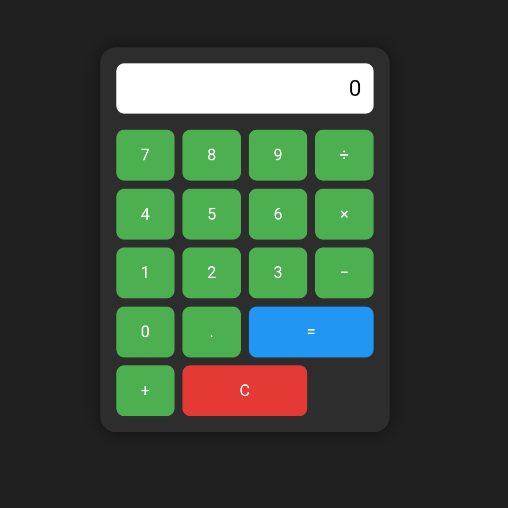

# Web Calculator - Python Flask

A stylish, interactive calculator built using **Python Flask**.  
Supports full arithmetic expressions using a calculator-style UI with buttons.

## 🛠️ Features
- Fully functional calculator with input display
- HTML + CSS frontend styled like a real calculator
- Operators: +, −, ×, ÷
- Error handling and clear function
- Built without JavaScript — pure Flask

## 📷 Demo Screenshot

## 🚀 Technologies Used
- Python 3
- Flask
- HTML5 & CSS3 (Responsive)

## 🎓 Made By
Abhilash Mamminiyan  
Built entirely using mobile (Pydroid 3) as part of my learning journey.
